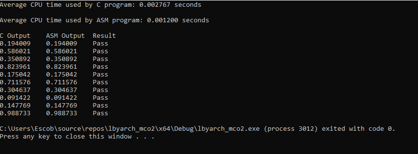
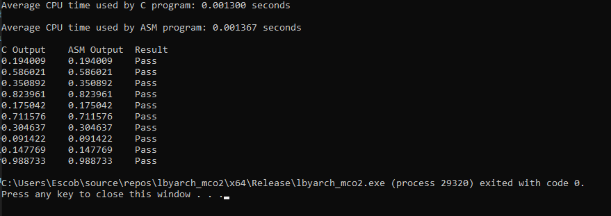
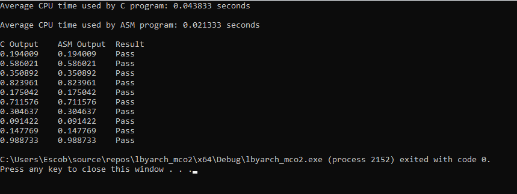
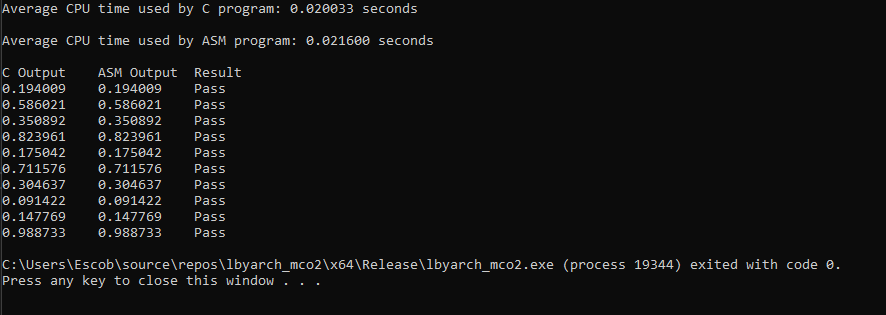
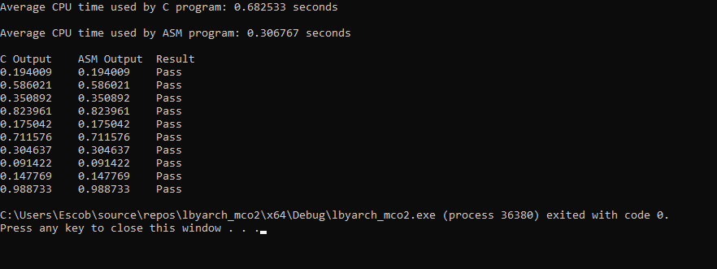
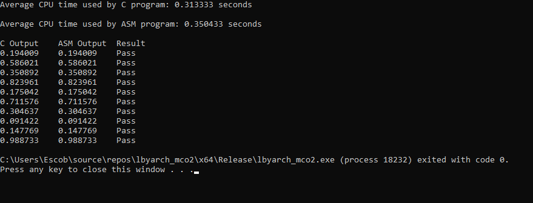

# LBYARCH MCO2 (DAXPY OPERATION) 
**MP Group 13: Matthew Escober, Mezen Lababidi**

## Correctness Check & Analysis

*Figure 1: Comparison of Time and Outputs for N = 2^20 in debug mode*

*Figure 2: Comparison of Time and Outputs for N = 2^20 in release mode*

*Figure 3: Comparison of Time and Outputs for N = 2^24 in debug mode*

*Figure 4: Comparison of Time and Outputs for N = 2^24 in release mode*

!

*Figure 5: Comparison of Time and Outputs for N = 2^28 in debug mode*

*Figure 6: Comparison of Time and Outputs for N = 2^28 in release mode*

Overall Average Time of C: 0.177299833

Overall Average Time of ASM: 0.117116667

This means then that on average across 30 test runs per input size per mode, ASM executes faster than C. This is probably due to ASM being a lower level language therefore making it easier for the machine to process whereas the C code has to be broken down into ASM before it can be executed by the machine adding an overhead for the C execution time.

